As you may have seen in the previous chapter about workflows, cogs are the individual instructions that make up an
Engine's workflow. There is no secret: each cog represents a specific action, and they are executed in the order they
are arranged in the workflow.

There are a couple of different types of cogs, and we will keep releasing new ones in the future.

In this chapter, we will go throuhg different types of cogs available in Cogfy Messenger and how to configure them.

## Command cog

The Command cog is a special cog that allows you to trigger a differnet set of cogs when the user types the specified
command name, preceded by a slash (/).

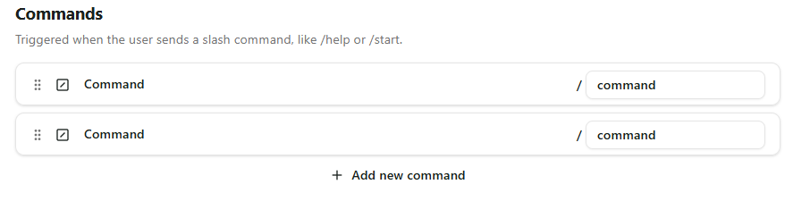

Commands are a great way to provide quick access to specific functionalities of your bot, without having to rely on LLM
interpretation for intention recognition, which might not always be accurate.

When a command cog is matched, the default workflow is ignored. For that reason, command cogs are placed outside the
default section and they cannot be placed inside other cogs, such as routers.

<Info>
Commands are shown to users as suggestions when they type the slash (/) character in the chat input.
</Info>

## Send Message cog

The Send Message cog is used to send a predefined message to the user.

Because messages can be reused in multiple places and some of them can be quite complex (for example, Whatsapp Flows),
we decided to move the creation of messages to a separate section called "Messages", as you can find in the sidebar.

After having at least one message created, you configure a Send Message cog to reference one of those messages in the
cog's dropdown, as shown below.

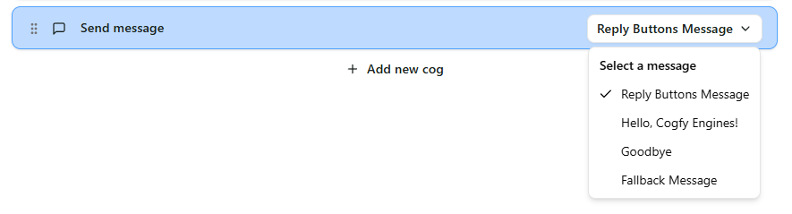

## Run Assistant cog

The Run Assistant cog is used to run a Engine Assistant to generate a reply, considering the current conversation
context.

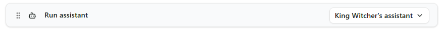

<Info>
Not to be confused with with the old Cogfy Assistants: Engine Assistants are a new concept of assistants that are scoped
by Engine and meant to be used by Engines only.
</Info>

Because of the complexity and reusability of configuring an Engine Assistant, we also moved their creation to a separate
section called "Assistants", which is covered in the Assistants chapter of this guide.

## Router cog

The Router cog is used to route the workflow execution to different paths based on certain conditions.

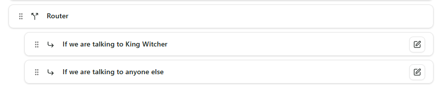

Conditions can be configured by clicking on the pencil icon on the right of each path cog, which will prompt a modal
where you can intuitively set up conditions, as follows:

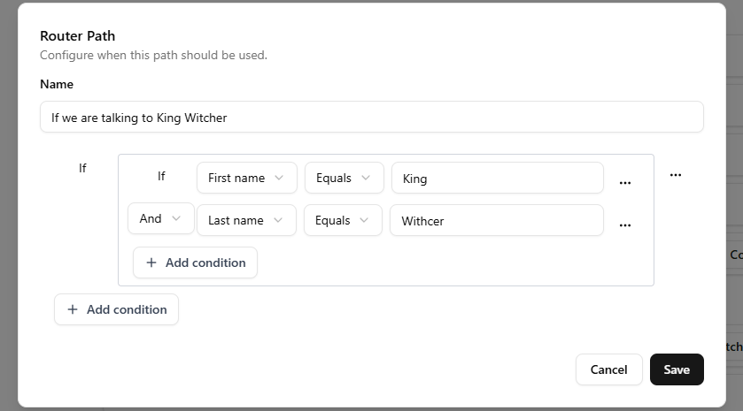

As long as there aren't any typos, this path will only be matched if the first name is equal to King and the second name
is equal to Witcher.

<Info>
- After executing the matching path, the workflow execution will continue after the router cog.
- If more than one path matches the conditions, only the first matching path will be executed.
</Info>

<Tip>
Cogs can be dragged and dropped from and into paths for better user experience.
</Tip>

## LLM Router cog

Rather then relying on predefined conditions, the LLM Router cog is used to route the workflow execution to different
paths based on the output of a Large Language Model (LLM), such as GPT, consdiering the current conversation context and
any custom prompt you may want to provide.

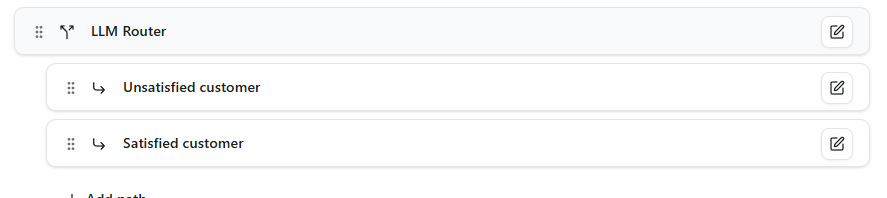

<Tip>
Just like the Router cog, cogs can be dragged and dropped from and into paths.
</Tip>

### LLM Router

The LLM Router cog on top allows you to define the model, some optional instructions to guide the model's behavior and a
default behavior in case none of the paths are matched by the LLM, as shown below:

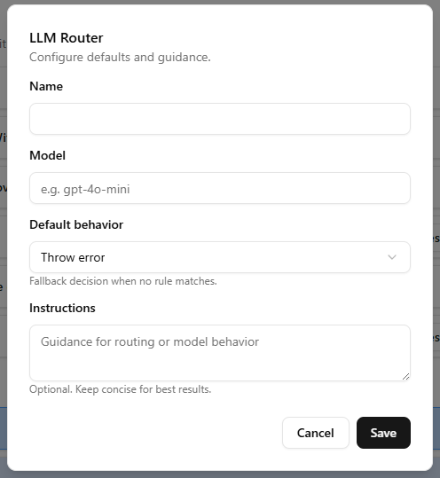

The default behavior field describes what to do if none of the paths are matched. You can choose between the following
options:

- **Use first route**: Route to the first path defined in the LLM Router cog.
- **Use last route**: Route to the last path defined in the LLM Router cog.
- **Throw error**: Throw an error and stop the workflow execution.
- **Stop**: Stop the workflow execution. Further cogs will not be executed.
- **Run next cog**: Continue the workflow execution with the next cog after the LLM Router cog.
- **Send default message**: Send a predefined message of your choice to the user.

### LLM Router Path

Each LLM Router Path cog allows you to define the name of the path and a prompt that will be used to determine which
path to take. Both the name and the prompt will be used by the LLM.

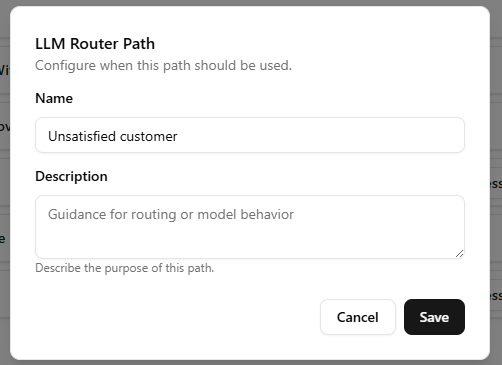

<Info>
Keep the route names short and simple, as they will be provided to the LLM as options to choose from. Excessive
complexty may lead to LLM confusion and unexpected behavior.
</Info>

## Update Contact cog

The Update Contact cog updates a field of your choice in the contact profile.

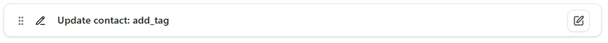

<Info>
For now, the only supported options are adding and removing tags from the contact, because it wouldn't make sense to
update other fields to predefined values. In the future, we may add support for more complex updates using variables.
</Info>

## HTTP Request cog

The HTTP Request cog allows you to make HTTP requests to external services.

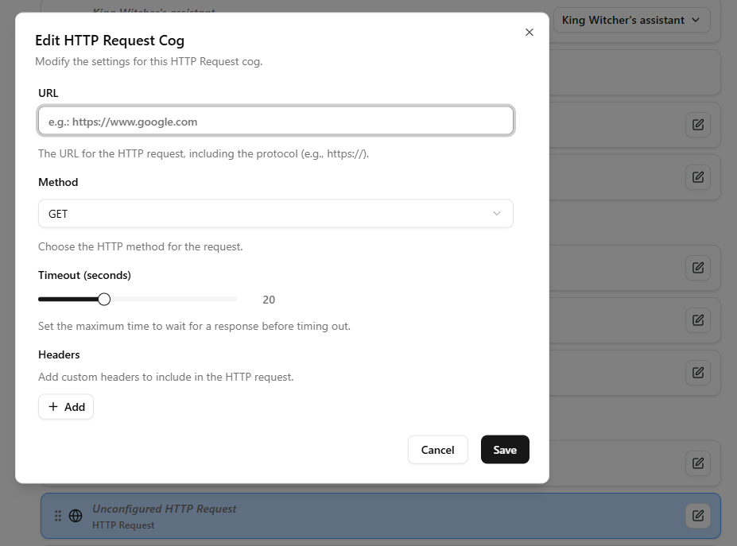

When you click on the pencil icon on the right, a modal will open where you can configure the HTTP request in detail.
Most fields are self-explanatory, and you can also configure a request timeout for when the external service takes too
long to respond, as you can see in the example above.

## Try-Catch cog

The Try-Catch cog allows you to handle errors gracefully in your workflow.

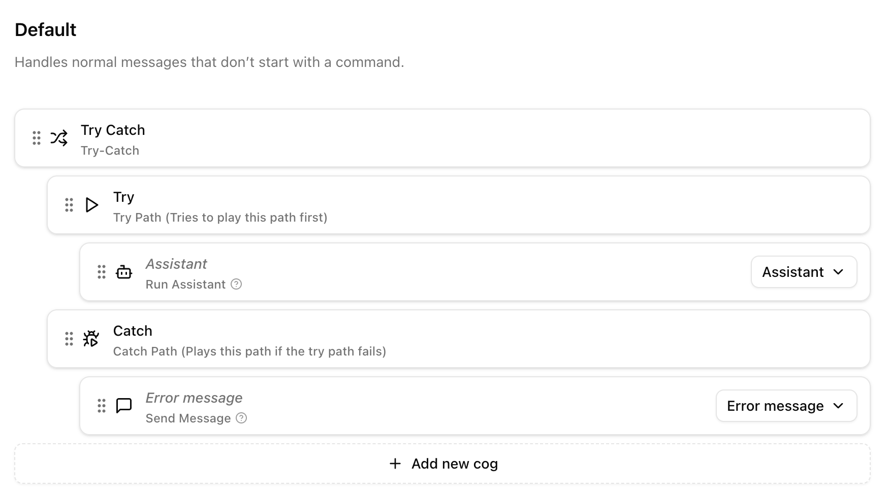

The Try path contains the cogs that will be executed normally. If any of those cogs throw an error, the execution will
jump to the Catch path, where you can define how to handle the error, for example by sending a message to the user apologizing for
the inconvenience.

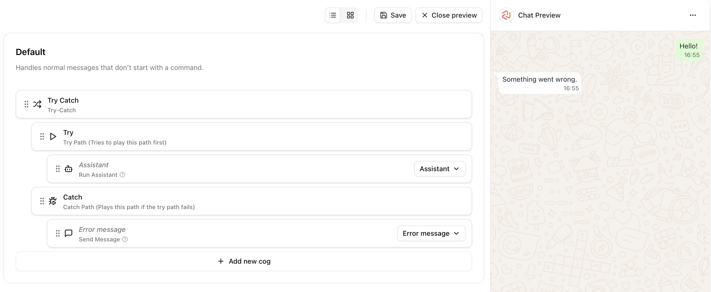

## Send Typing Indicator cog

The Send Typing Indicator cog allows you to send a typing indicator to the user, simulating the typing behavior of a
human agent. This cog is especially useful when you have cogs that may take some time to execute, such as the Run Assistant
cog or the HTTP Request cog, as it helps to maintain user engagement and improve the overall conversation experience.

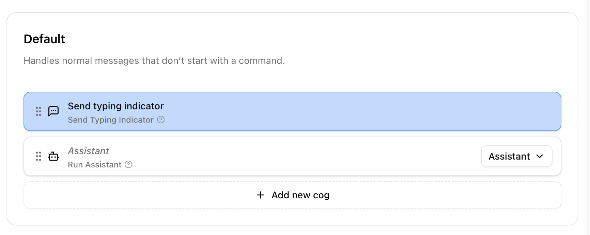
