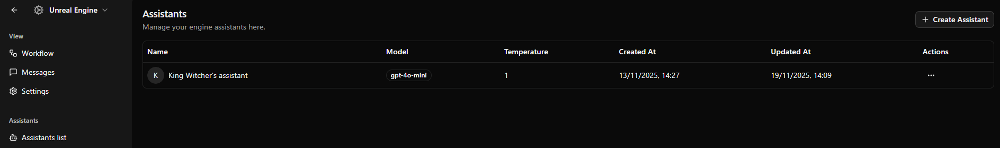
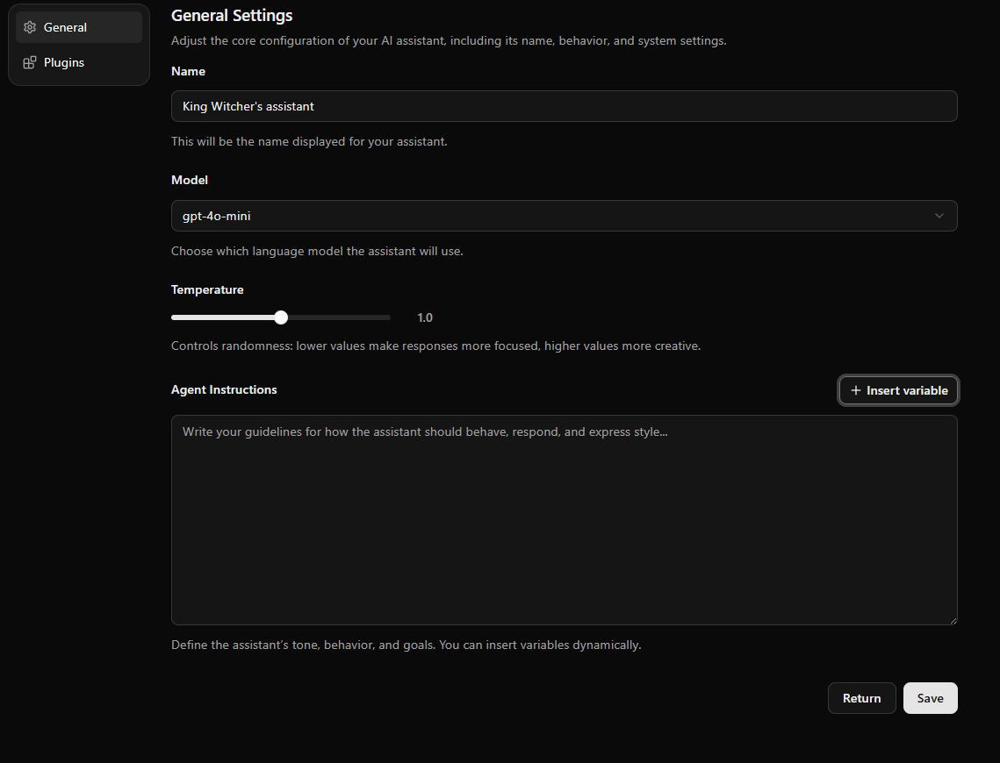
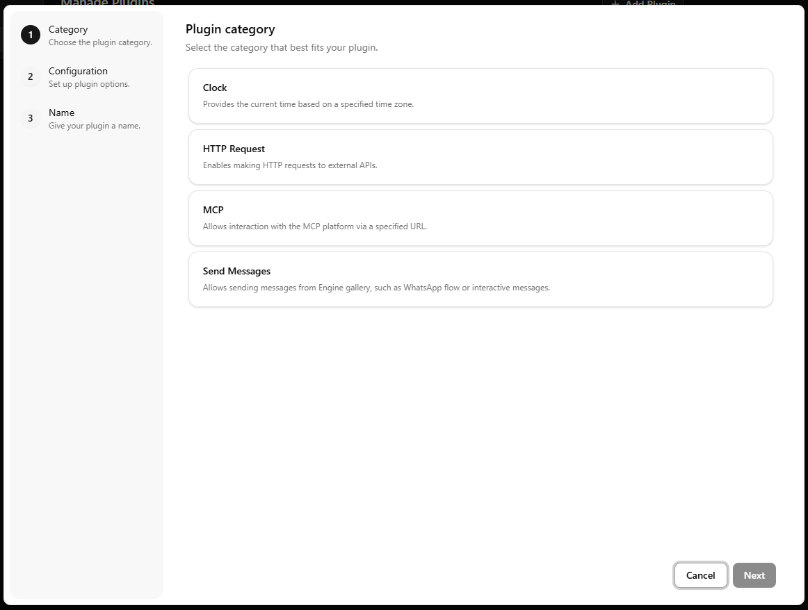

Another pivotal concept in Cogfy Messenger is Engine Assistants. Each Assistant
represents a different AI persona with its own unique behavior, instructions,
knowledge and capabilities that can be used to generate responses within an
Engine's workflow (view Run Assistant cog).

In this chapter, we will explore how they work and what they can do for you.

## Creating an Engine Assistant

To create a new Engine Assistant, navigate to the "Assistants" section in the
sidebar and click on the "Create Assistant" button, as show below.

After that, you can click on the assistat's name to open the configuration page.

Lets take a look at the general tab:

As you can see, you can set a name for your assistant, which will be used to
identify it within the Engine's workflow.

Right below, you can see the "Model" dropdown, which allows you to select the AI
model that will be used by this assistant to generate responses. You can choose
between different models, such as GPT-3.5, GPT-4, and others. Some models may be
more accurate but slower, while others may be faster but less accurate.

Next, there is the temperature slider, which allows you to control the
randomness of the assistant's responses. A lower temperature will result in more
deterministic and focused responses, while a higher temperature will result in
more diverse and creative responses.

Finally, there is the "Agent Instructions" field, which allows you to provide
custom instructions to guide the assistant's behavior. These instructions will
be prepended to every prompt sent to the AI model, so you can use them to set
the tone, style, or specific guidelines for the assistant's responses.

Still in the instructions field, you can interpolate variables using the
`{{ variable_name }}` syntax. The list of available variables can be found in
"Insert Variable" dropdown right next to the field.

## Plugins

Very similarly to the original Cogfy Assistants, Engine Assistants can be
extended with Plugins to provide them with additional capabilities, such as
accessing external APIs, interacting with MCP services, querying the clock, and
others.

In order to add a plugin to an Engine Assistant, navigate to the "Plugins" tab
in the Assistant's configuration page, and click on the "Add Plugin" button on
the top right to open the following modal:

We will keep developing new plugins over time but, as you can see, there are
currently four types of plugins available:

- **Clock**: allows the assistant to access the current date and time.
- **HTTP Request**: allows the assistant to make HTTP requests to external APIs.
- **MCP**: allows the assistant to interact with MCP services.
- **Send Messages**: allows the assistant to send messages from the messages gallery.

### Clock

LLMs are made of static data that, after going through complex mathematical
operations, can generate human-like text. Therefore, these calculations
naturally don't have access to the time at which they are being computed.

Because of that, the Clock plugin is pretty straightforward: it attaches Date
and Time information to the prompt, so that the LLM can use it when generating
responses.

### HTTP Request

The HTTP Request is an advanced plugin allows the assistant to make HTTP
requests to external APIs as it's generated response, instead of generating
text.

Selecting this plugin will open a configuration form where you can set the
HTTP method, URL, headers, timeout and body of the request.

<Info>
More technically, this plugin achieves this by setting a *tool*
in the LLM's prompt with some description.
</Info>

### MCP

The MCP plugin allows the assistant to interact with services compatible with the Model Context Protocol. By enabling this plugin, the assistant gains access to external tools exposed by an MCP server, allowing it to perform operations such as retrieving data, executing actions, or accessing custom business logic.

After selecting this plugin, simply choose the MCP service you want the assistant to use. All tools provided by that service will then be available to the LLM as part of its response-generation workflow.

You can learn more about MCP in the official [documentation](https://modelcontextprotocol.io/docs/getting-started/intro).

### Send Messages

This plugin is the simples plugin: it basically gives the LLM the capability to
send a send a specific message from your messages gallery as is's response.

For that, you should give a short name and a brief description to help the LLM
understand when to send this message.

<Info>
Just like the HTTP Request plugin, this plugin achieves this by setting a *tool*
in the LLM's prompt with some description.
</Info>
